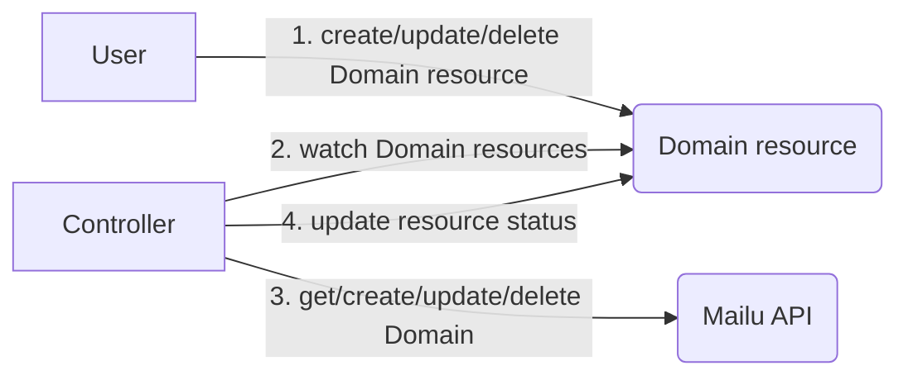

# mailu-operator

The purpose of this project is to define Email Domains, Users and Aliases used in Mailu via CRs.

The Mailu-Operator uses the Mailu API to create/update/delete Domains, Users and Aliases, it therefore needs the API 
endpoint and token which can be set through command line or the environment variables `MAILU_SERVER` and `MAILU_TOKEN`.

**Important note**: A user can still make changes in the Mailu frontend which are not synced back to the CRDs.
Also, some changes may be intended to be done "on-the-fly" in the Mailu frontend, for example setting auto reply or changing the password.

## Description

This operator adds three custom resources: `Domain`, `User` and `Alias` and each resource represents an object in Mailu API.
For details refer also to your Mailu API documentation: https://mailu.io/master/api.html

Domain fields and defaults (see [sample](config/samples/operator_v1alpha1_domain.yaml))
- Name (required)
- Comment
- MaxUsers
- MaxAliases
- MaxQuotaBytes
- SignupEnabled
- Alternatives

User fields and defaults (see [sample](config/samples/operator_v1alpha1_user.yaml))
- Name (required)
- Domain (required)
- AllowSpoofing
- ChangePwNextLogin
- Comment
- DisplayedName
- Enabled
- EnableImap
- EnablePop
- ForwardDestination
- ForwardEnabled
- ForwardKeep
- GlobalAdmin
- Password (hash, excluded from updates)
- PasswordSecret (takes precedence over `RawPassword`, secret name in the current namespace)
- PasswordKey (key within the `PasswordSecret` which contains the password)
- QuotaBytes
- QuotaBytesUsed (excluded from updates)
- RawPassword (excluded from updates; **optional**: if not set, a random password will be generated)
- ReplyBody (TODO: excluded from updates)
- ReplyEnabled (TODO: excluded from updates)
- ReplyEnddate (TODO: excluded from updates)
- ReplyStartdate (TODO: excluded from updates)
- ReplySubject (TODO: excluded from updates)
- SpamEnabled
- SpamMarkAsRead
- SpamThreshold

Alias fields and defaults (see [sample](config/samples/operator_v1alpha1_alias.yaml))
- Name (required)
- Domain (required)
- Comment
- Destination
- Wildcard

### Simplified flow

Using `Domain` as an example resource


## Getting Started

### Prerequisites

- go version v1.21.0+
- docker version 17.03+.
- kubectl version v1.11.3+.
- Access to a Kubernetes v1.11.3+ cluster.
- A running installation of [Mailu](https://github.com/Mailu/Mailu) with API enabled.


## Try it out

As this project is brand new and in alpha stage, here are the current steps to try it out:

```shell
REGISTRY=<your-registry>
# 1. build the image and push it to your own registry
make docker-buildx IMG=$REGISTRY/mailu-operator:v0.0.1

# 2. build the `install.yaml` used to deploy the operator (including CRDs, Roles and Deployment)
make build-installer IMG=$REGISTRY/mailu-operator:v0.0.1

# 3. apply the `install.yaml` to your k8s cluster
kubectl apply -f dist/install.yaml
```

Uninstall
```shell
kubectl delete -f dist/install.yaml
```

## Development: Build and deploy on your cluster

To setup the project, `operator-sdk` was used to generate the structure and custom resource objects:
```shell
operator-sdk init --plugins=go/v4 --domain mailu.io --repo github.com/sickhub/mailu-operator
operator-sdk create api --group operator --version v1alpha1 --kind Domain --resource --controller
operator-sdk create api --group operator --version v1alpha1 --kind User --resource --controller
operator-sdk create api --group operator --version v1alpha1 --kind Alias --resource --controller
```

**Build and push your image to the location specified by `IMG`:**

```sh
make docker-build docker-push IMG=<some-registry>/mailu-operator:tag
```

**NOTE:** This image ought to be published in the personal registry you specified.
And it is required to have access to pull the image from the working environment.
Make sure you have the proper permission to the registry if the above commands don’t work.

**Install the CRDs into the cluster:**

```sh
make install
```

**Deploy the Manager to the cluster with the image specified by `IMG`:**

```sh
make deploy IMG=<some-registry>/mailu-operator:tag
```

> **NOTE**: If you encounter RBAC errors, you may need to grant yourself cluster-admin
privileges or be logged in as admin.

**Create instances of your solution**
You can apply the samples (examples) from the config/sample:

```sh
kubectl apply -k config/samples/
```

>**NOTE**: Ensure that the samples has default values to test it out.

### To Uninstall
**Delete the instances (CRs) from the cluster:**

```sh
kubectl delete -k config/samples/
```

**Delete the APIs(CRDs) from the cluster:**

```sh
make uninstall
```

**UnDeploy the controller from the cluster:**

```sh
make undeploy
```

## Project Distribution

Following are the steps to build the installer and distribute this project to users.

1. Build the installer for the image built and published in the registry:

```sh
make build-installer IMG=<some-registry>/mailu-operator:tag
```

NOTE: The makefile target mentioned above generates an 'install.yaml'
file in the dist directory. This file contains all the resources built
with Kustomize, which are necessary to install this project without
its dependencies.

2. Using the installer

Users can just run kubectl apply -f <URL for YAML BUNDLE> to install the project, i.e.:

```sh
kubectl apply -f https://raw.githubusercontent.com/<org>/mailu-operator/<tag or branch>/dist/install.yaml
```

## Contributing
// TODO(user): Add detailed information on how you would like others to contribute to this project

**NOTE:** Run `make help` for more information on all potential `make` targets

More information can be found via the [Kubebuilder Documentation](https://book.kubebuilder.io/introduction.html)

## License

Copyright 2024.

Licensed under the Apache License, Version 2.0 (the "License");
you may not use this file except in compliance with the License.
You may obtain a copy of the License at

    http://www.apache.org/licenses/LICENSE-2.0

Unless required by applicable law or agreed to in writing, software
distributed under the License is distributed on an "AS IS" BASIS,
WITHOUT WARRANTIES OR CONDITIONS OF ANY KIND, either express or implied.
See the License for the specific language governing permissions and
limitations under the License.

